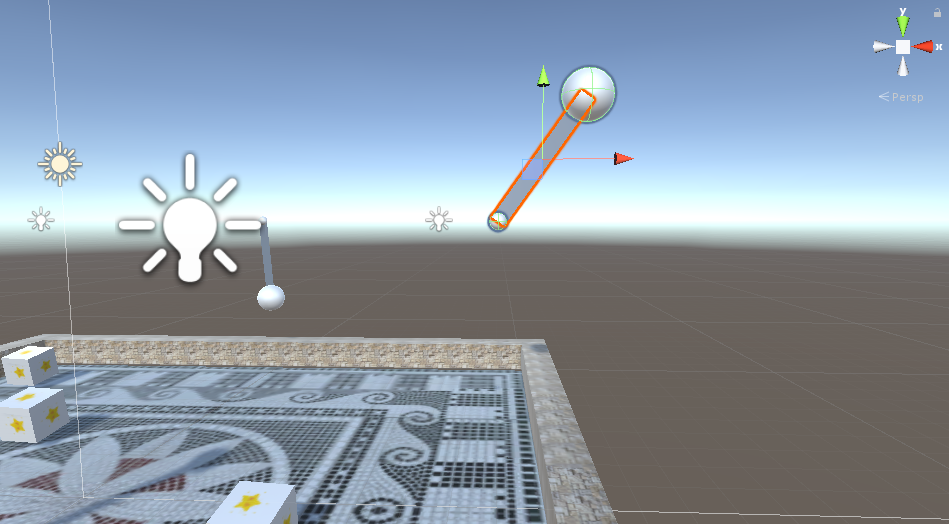
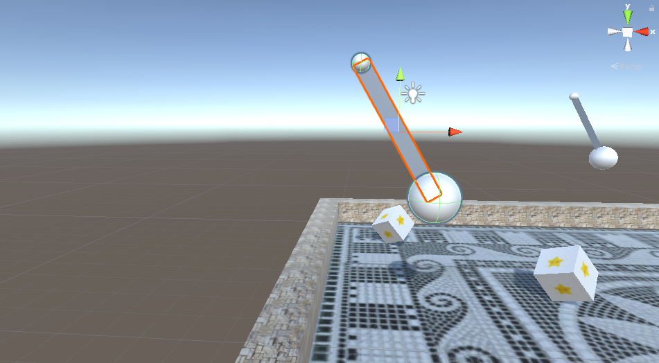
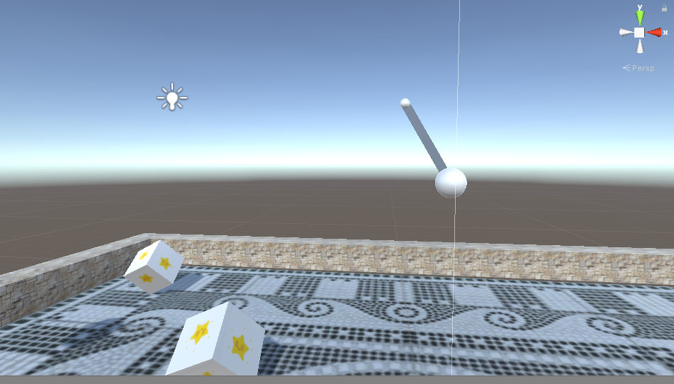
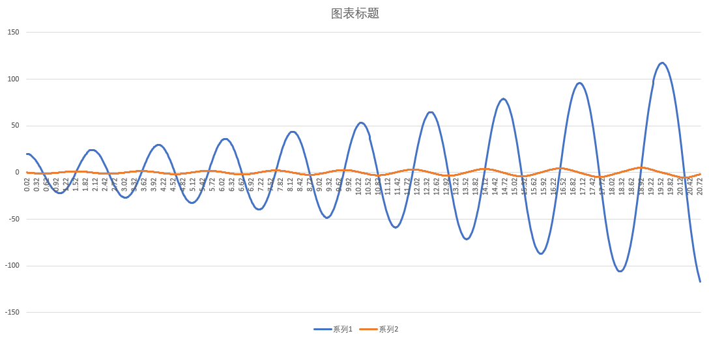
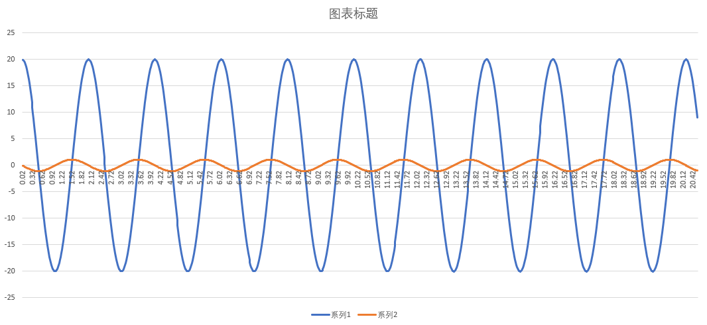
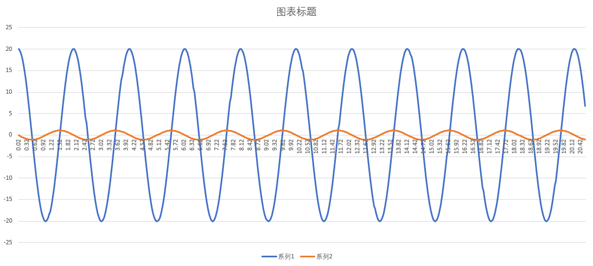
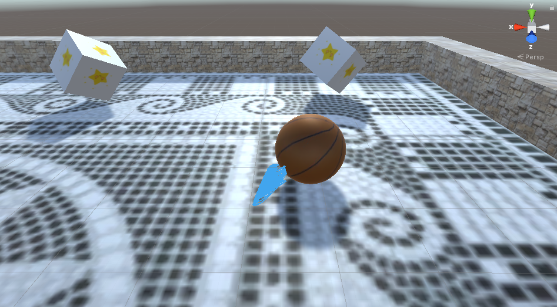
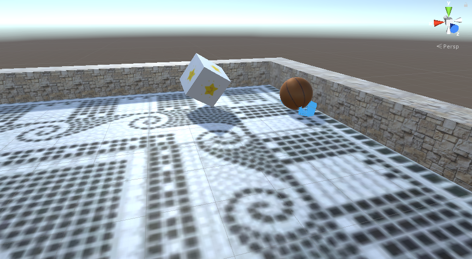

# Game Physics

## 单摆模拟

### 实现细节

单摆使用两个球体，其中一个作为基点，另一个作为摆锤，中间使用 Line Renderer 渲染。

基点的位置不变，根据 θ 角度确定摆锤的位置：

``` c#
Vector3 newCycloid = Quaternion.Euler(0, 0, sita) * cycloid;
penPoint.transform.SetPositionAndRotation(basePos + newCycloid, penPoint.transform.rotation);
```

将静止时摆线向量（`cycloid`）旋转 θ 角即可得到某一时刻的摆线向量，将基点与摆线向量相加可得摆锤的位置。

### 算法差异

#### Euler

``` c#
float localSita = sita;
float localOmega = omega;

sita = sita + localOmega * time;
omega = omega - (g / l) * Mathf.Sin(localSita * Mathf.Deg2Rad) * time;
```

效果如下：



摆动幅度过大是算法本身的误差导致的。

#### Midpoint

``` c#
float halfTime = time / 2.0f;
float midSita = sita + omega * halfTime;
float midOmega = omega - (g / l) * Mathf.Sin(sita * Mathf.Deg2Rad) * halfTime;

sita = sita + midOmega * time;
omega = omega - (g / l) * time * Mathf.Sin(midSita * Mathf.Deg2Rad);
```

效果如下：



摆动十分稳定。

#### Trapezoid

``` c#
float nextSita = sita + omega * time;
float nextOmega = omega - (g / l) * Mathf.Sin(sita * Mathf.Deg2Rad) * time;

float localSita = sita;
float localOmega = omega;

sita = sita + (nextOmega + omega) / 2 * time;
omega = omega - ((g / l) * Mathf.Sin(localSita * Mathf.Deg2Rad) + (g / l) * Mathf.Sin(nextSita * Mathf.Deg2Rad)) / 2 * time;
```

效果如下：



效果与 Midpoint 相近， 摆动十分稳定。

### 图表分析

使用 Python 模拟算法，然后输出模拟结果，得到三种模拟算法图表对比如下：

| Euler | Midpoint | Trapezoid |
|---|---|---|
|  |  |  |

图表显示的结果与游戏中的效果基本一致，而游戏中 Euler 方法最后由于摆动幅度越来越大，最后会旋转起来。

## 头发模拟

### 实现细节

单根头发由一系列的头发节点组成：

``` c#
public class HairNode;

public class HairSimulator : MonoBehaviour {
    public Vector3 hairRoot;
    private List<HairNode> hairNodes = new List<HairNode>();
}
```

在进行头发的模拟时，首先使用 Verlet 方法计算出该时刻所有节点的位置，然后再多次迭代施加约束，包括碰撞和节点之间的距离约束。由 `hairRoot` 确定发根的位置。

头发的渲染使用 Line Renderer 进行渲染。

单根头发实现以后，将头发分布在球面即可：

``` c#
public class HairSpawner : MonoBehaviour {
    private List<HairSimulator> simulators = new List<HairSimulator>();
}
```

按照球面坐标公式，每经过一定间隔就选取一点作为发根位置。

### 实现效果





## 游戏操作指南

+ `WASD` 控制小球的运动。
+ 玩家控制的小球上长有头发。
+ 在地图的四个方向可以看到四个单摆。

